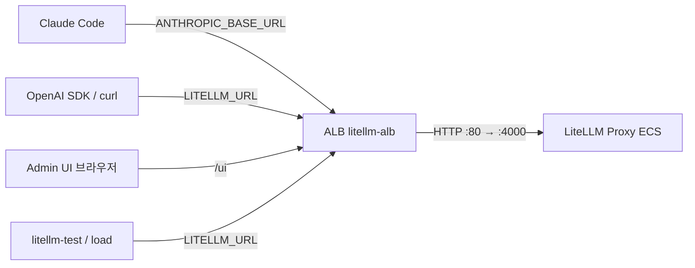
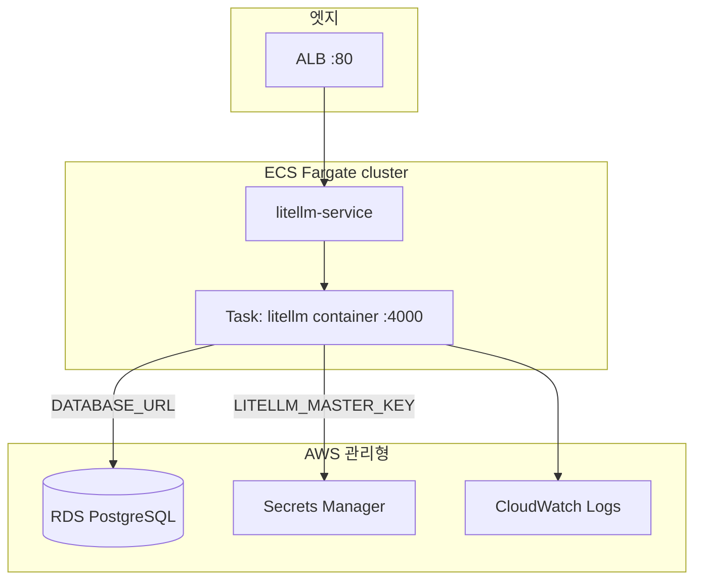
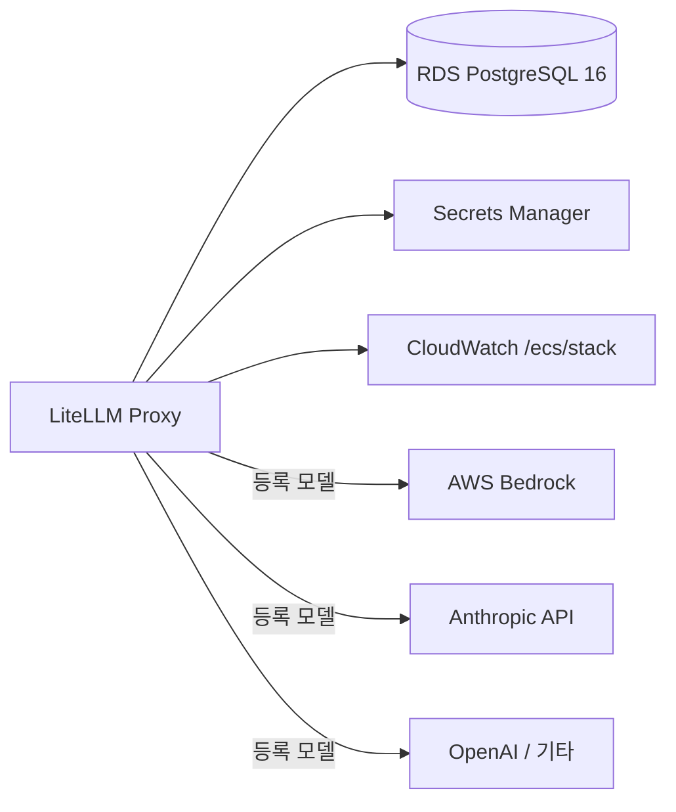

# LiteLLM 활용 가이드 (AWS)

LiteLLM Proxy를 AWS ECS Fargate에 배포하는 가이드입니다.

## 목차

1. [LiteLLM이란?](#litellm이란)
2. [운영 아키텍처](#운영-아키텍처) — [트래픽](#1-트래픽-경계-클라이언트--alb--ecs) · [컴퓨트](#2-ecs-워크로드) · [데이터·AI](#3-데이터-플레인--ai-백엔드)
3. [사전 요구사항](#사전-요구사항)
4. [설치 · 배포](#설치--배포)
5. [접속 정보 (URL · Admin UI · Master key)](#접속-정보-url--admin-ui--master-key) ← 배포 후 가장 먼저
6. [모델 등록](#모델-등록)
7. [API 호출](#api-호출)
8. [사용자/조직별 한도 설정](#사용자조직별-한도-설정)
9. [Claude Code 연동](#claude-code-연동)
10. [테스트](#테스트)
11. [삭제](#삭제)
12. [비용 검토](#비용-검토)
13. [프로덕션 체크리스트](#프로덕션-체크리스트)
14. [트러블슈팅](#트러블슈팅)

---

## LiteLLM이란?

**LiteLLM**은 OpenAI, Anthropic, AWS Bedrock 등 100개 이상 LLM을 **단일 OpenAI 호환 API**로 묶어 주는 게이트웨이입니다.

| 기능 | 설명 |
|------|------|
| 통합 API | `/v1/chat/completions`, `/v1/messages` 등으로 모든 제공자 호출 |
| 로드 밸런싱 · 폴백 | 모델/제공자 장애 시 자동 라우팅 |
| 비용 · 예산 · Rate limit | 키/팀 단위 사용량 추적 |
| Virtual key | 프로바이더 키를 앱에 넣지 않고 게이트웨이 키만 배포 |
| Admin UI | 모델·키·사용량 웹 대시보드 (`/ui`, Proxy와 **같은 ALB**) |

이 레포의 `install/installer.py`가 올리는 형태는 아래와 같습니다. 상세는 [운영 아키텍처](#운영-아키텍처).

```
[클라이언트] → [ALB] → [LiteLLM Proxy (ECS)] → [Bedrock / Anthropic / …]
                              ↓
                        [RDS + Secrets]
```

---

## 운영 아키텍처

한 장에 다 넣으면 읽기 어려우므로 **트래픽 / 컴퓨트 / 데이터·AI** 세 장으로 나눕니다.  
(llm-gateway보다 단순: ALB·서비스·DB가 각각 1개.)

### 1) 트래픽 경계 (클라이언트 → ALB → ECS)



| 경로 | 진입점 | 비고 |
|------|--------|------|
| 추론 (`/v1/messages`, `/v1/chat/completions`) | **ALB → Proxy** | `LITELLM_URL` / `ANTHROPIC_BASE_URL` |
| Admin UI | **같은 ALB** `/ui` | Username `admin`, Password = Master key |
| Health | ALB `/health/liveliness` | Target Group health check와 동일 |
| Master key | Secrets Manager `{stack}/master-key` | API Bearer + UI 비밀번호 |

> llm-gateway처럼 gateway / admin-ui / admin-api ALB를 나누지 **않습니다**. Proxy·UI·API가 **하나의 ALB + 하나의 ECS 서비스**입니다.

### 2) ECS 워크로드



| 리소스 | 이름 패턴 | 역할 |
|--------|-----------|------|
| Cluster | `{stack}-cluster` | Fargate |
| Service | `{stack}-service` | desired count (기본 1) |
| Task | `{stack}-task` | 이미지 `ghcr.io/berriai/litellm:main-stable` |
| ALB / TG | `{stack}-alb` / `{stack}-tg` | HTTP 80 → 4000, health `/health/liveliness` |
| Exec / Task Role | `{stack}-ecs-exec-role` / `-ecs-task-role` | 시크릿 주입 · (Bedrock 시) InvokeModel |

### 3) 데이터 플레인 · AI 백엔드



| 구성 | 용도 |
|------|------|
| RDS | virtual key, 사용량, Admin UI에 등록한 모델 설정 (`STORE_MODEL_IN_DB=True`) |
| Secrets | `{stack}/master-key`, `{stack}/db-password` |
| Bedrock 등 | Admin UI / `/model/new` / `litellm-test.py --register-bedrock` 으로 등록한 뒤에만 호출 |

Security Groups:

```
인터넷 ──:80──► ALB SG ──:4000──► Task SG ──:5432──► RDS SG
```

배포 계층:

```
install/installer.py → SG / Secrets / RDS / IAM / ALB / Task Def / ECS Service
                     → install/.state-<stack>.json  (URL·Admin UI·key, gitignored)
                     → register_models.py (Claude Bedrock + GPT if key)
```

접속 URL·키는 배포 후 [접속 정보](#접속-정보-url--admin-ui--master-key)에서 조회합니다.

---

## 사전 요구사항

- AWS CLI 자격증명 (`aws configure` 또는 환경변수)
- 대상 리전에 **default VPC** + public subnet 2개 이상
- Python 3.10+
- 권한: ECS, EC2, RDS, ELBv2, IAM, Secrets Manager, CloudWatch Logs

이 문서 예시는 검증된 리전 **`us-west-2`**, 스택명 **`litellm`** 을 사용합니다.  
다른 리전/이름을 쓰려면 명령의 `--region` / `--stack-name` 만 바꾸면 됩니다.

```bash
export AWS_REGION=us-west-2
export STACK=litellm
```

---

## 설치 · 배포

### 1. 클론 · 의존성

```bash
git clone https://github.com/kyopark2014/litellm-guide.git
cd litellm-guide
pip install -r install/requirements.txt
aws sts get-caller-identity   # 계정 확인
```

### 2. 배포

```bash
python install/installer.py deploy --region us-west-2 --stack-name litellm
```

이미 같은 리전·스택이 있으면 **재생성하지 않고** 상태 파일만 갱신한 뒤 종료합니다.

옵션 예:

```bash
python install/installer.py deploy \
  --region us-west-2 \
  --stack-name litellm-prod \
  --cpu 2048 \
  --memory 4096 \
  --desired-count 2 \
  --db-instance-class db.t3.small
```

약 **8–12분** 소요 (RDS 생성 구간이 가장 김).  
완료 시 터미널에 URL·Admin UI·Master key가 출력되고, 동일 내용이 **`install/.state-<stack>.json`** 에 저장됩니다 (`.gitignore` — git에 올리지 않음).

같은 값은 언제든 [접속 정보](#접속-정보-url--admin-ui--master-key)에서 다시 조회할 수 있습니다.

---

## 접속 정보 (URL · Admin UI · Master key)

배포 직후·운영 중 접속에 필요한 값은 **전부 여기서** 확인합니다.

Admin UI 로그인 화면의 *Password is your set LiteLLM Proxy MASTER_KEY* 에서 말하는 **MASTER_KEY**도 아래와 같은 값입니다 (`sk-…`).  
Username `admin`의 비밀번호이자 API `Authorization: Bearer` 토큰으로 씁니다.

### 조회 방법

**1. `status` (권장)** — URL · Admin UI · Master key · Client env를 한 번에 출력하고 `install/.state-<stack>.json` 도 갱신합니다.

```bash
python install/installer.py status --region us-west-2 --stack-name litellm
```

| 출력 줄 | 어디에 쓰나 |
|---------|-------------|
| `URL` | API base (`LITELLM_URL`, Claude Code `ANTHROPIC_BASE_URL`) |
| `Admin UI` | 브라우저 대시보드 (`/ui`) |
| `Master key` | Admin UI **Password** + API Bearer |
| `Running` | **1 이상**이어야 API/UI가 정상 |

출력의 `Client env`를 셸에 붙여 넣으면 `$LITELLM_URL` / `$LITELLM_MASTER_KEY` 를 이후 절에서 그대로 쓸 수 있습니다.

**2. 로컬 state 파일** (gitignore — 커밋 금지)

```bash
STATE=install/.state-litellm.json
jq -r .master_key "$STATE"          # MASTER_KEY만
export LITELLM_URL=$(jq -r .url "$STATE")
export LITELLM_MASTER_KEY=$(jq -r .master_key "$STATE")
export ANTHROPIC_BASE_URL="$LITELLM_URL"
export ANTHROPIC_AUTH_TOKEN="$LITELLM_MASTER_KEY"
```

**3. AWS CLI** (`installer.py` 없이)

```bash
REGION=us-west-2
STACK=litellm

ALB_DNS=$(aws elbv2 describe-load-balancers \
  --names "${STACK}-alb" --region "$REGION" \
  --query 'LoadBalancers[0].DNSName' --output text)
echo "URL:      http://${ALB_DNS}"
echo "Admin UI: http://${ALB_DNS}/ui"

aws secretsmanager get-secret-value \
  --secret-id "${STACK}/master-key" --region "$REGION" \
  --query SecretString --output text
```

### Admin UI 로그인

| 항목 | 값 |
|------|-----|
| 주소 | 위 조회의 **Admin UI** (`http://<alb-dns>/ui`) |
| Username | `admin` |
| Password | 위 조회의 **Master key** (`sk-…`) |

> 기본 ALB는 **HTTP**입니다. 브라우저·터미널이 ALB DNS에 도달해야 합니다.  
> Admin UI에서 master key를 바꿔도 Secrets Manager / `.state`와 자동 동기화되지 않을 수 있으니, 운영 시에는 한쪽을 기준으로 맞추세요.

### Health 확인

ECS task가 healthy가 되기까지 **1–3분** 걸릴 수 있습니다.

```bash
curl -s "$LITELLM_URL/health/liveliness"    # → I'm alive!
curl -s "$LITELLM_URL/health/readiness"     # → status healthy, db connected
```

---

## 모델 등록

API·Claude Code·테스트 전에 **모델이 하나 이상** 있어야 합니다.  
`deploy` 직후(또는 이미 배포된 스택에 `deploy`를 다시 칠 때) installer가 **기본 모델 카탈로그**를 자동 등록합니다.

### 기본 등록 모델

| LiteLLM `model_name` | 백엔드 | 비고 |
|----------------------|--------|------|
| `claude-sonnet-4-6` | Bedrock `us.anthropic.claude-sonnet-4-6` | Sonnet 4.6 |
| `claude-opus-4-8` | Bedrock `us.anthropic.claude-opus-4-8` | Opus 4.8 |
| `claude-sonnet-5` | Bedrock `us.anthropic.claude-sonnet-5` | Sonnet 5 |
| `claude-fable-5` | Bedrock `us.anthropic.claude-fable-5` | Fable 5 |
| `claude-haiku-4-5` | Bedrock Haiku 4.5 inference profile | 저비용 테스트용 |
| `gpt-5.4` | **Bedrock Mantle** `openai.gpt-5.4` | OpenAI API 키 불필요 |
| `gpt-5.5` | **Bedrock Mantle** `openai.gpt-5.5` | 〃 |
| `gpt-5.6-sol` | **Bedrock Mantle** `openai.gpt-5.6-sol` | flagship |
| `gpt-5.6-terra` | **Bedrock Mantle** `openai.gpt-5.6-terra` | balanced |
| `gpt-5.6-luna` | **Bedrock Mantle** `openai.gpt-5.6-luna` | cost-efficient |

정의 파일: `install/models.py` · 등록 스크립트: `install/register_models.py`

```bash
# 수동 재등록 (이미 있으면 skip)
python install/register_models.py --region us-west-2 --stack-name litellm

# GPT를 Mantle 경로로 강제 재등록
python install/register_models.py --force
```

> Claude·GPT 모두 **AWS 계정 / ECS task role**로 호출합니다 (`bedrock:InvokeModel`). OpenAI `sk-` 키는 필요 없습니다.  
> Mantle GPT는 `https://bedrock-mantle.<region>.api.aws/openai/v1` 로 라우팅됩니다. Bedrock 콘솔에서 해당 모델 액세스 허용이 필요할 수 있습니다.

### 방법 A — 테스트 스크립트 (단일 Bedrock 모델)

```bash
python3 litellm-test.py \
  --region us-west-2 \
  --stack-name litellm \
  --model claude-haiku-4-5 \
  --register-bedrock
```

### 방법 B — Admin UI

1. [접속 정보](#접속-정보-url--admin-ui--master-key)의 Admin UI로 로그인  
2. Models → Add Model  
3. 저장 후 `model_name`을 API/`--model`에 사용

### 방법 C — API

```bash
# $LITELLM_URL, $LITELLM_MASTER_KEY 는 status Client env 기준
curl -X POST "$LITELLM_URL/model/new" \
  -H "Authorization: Bearer $LITELLM_MASTER_KEY" \
  -H "Content-Type: application/json" \
  -d '{
    "model_name": "claude-haiku-4-5",
    "litellm_params": {
      "model": "bedrock/us.anthropic.claude-haiku-4-5-20251001-v1:0",
      "aws_region_name": "us-west-2"
    }
  }'
```

Anthropic 직접 키를 쓸 때:

```bash
curl -X POST "$LITELLM_URL/model/new" \
  -H "Authorization: Bearer $LITELLM_MASTER_KEY" \
  -H "Content-Type: application/json" \
  -d '{
    "model_name": "claude-sonnet-4",
    "litellm_params": {
      "model": "anthropic/claude-sonnet-4-20250514",
      "api_key": "sk-ant-..."
    }
  }'
```

---

## API 호출

[접속 정보](#접속-정보-url--admin-ui--master-key)에서 `LITELLM_URL` / `LITELLM_MASTER_KEY`를 export한 뒤:

```python
import os
from openai import OpenAI

client = OpenAI(
    base_url=os.environ["LITELLM_URL"],   # status의 URL
    api_key=os.environ["LITELLM_MASTER_KEY"],
)

response = client.chat.completions.create(
    model="claude-haiku-4-5",             # 등록한 model_name
    messages=[{"role": "user", "content": "Hello!"}],
)
print(response.choices[0].message.content)
```

Anthropic Messages API:

```bash
curl -X POST "$LITELLM_URL/v1/messages" \
  -H "Authorization: Bearer $LITELLM_MASTER_KEY" \
  -H "anthropic-version: 2023-06-01" \
  -H "Content-Type: application/json" \
  -d '{
    "model": "claude-haiku-4-5",
    "max_tokens": 64,
    "messages": [{"role": "user", "content": "Hello!"}]
  }'
```

> Admin UI·API로 발급한 **virtual key**를 master key 대신 쓰면 모델·예산을 제한할 수 있습니다. → [사용자/조직별 한도 설정](#사용자조직별-한도-설정)

---

## 사용자/조직별 한도 설정

Master key(`sk-…`)는 **관리자용**입니다. 실사용자·팀에는 **virtual key**를 나눠 주고, `max_budget` / RPM·TPM으로 사용량을 제한하세요.  
이 스택은 RDS에 키·spend를 저장하므로(`STORE_MODEL_IN_DB=True`) Admin UI와 `/key/*` API가 바로 동작합니다.

공식 문서: [Virtual Keys](https://docs.litellm.ai/docs/proxy/virtual_keys) · [Budgets, Rate Limits](https://docs.litellm.ai/docs/proxy/users)

### 계층 구조

한도는 **여러 레벨에 동시에** 걸 수 있습니다. 요청은 적용되는 한도 중 **하나라도** 넘으면 거부됩니다.

```
Organization (조직)     ← 회사/사업 단위 상한 (선택)
    └── Team (팀)       ← 팀 공유 예산·모델 허용 목록
          └── User      ← 사용자 개인 예산 (여러 키에 누적)
                └── Virtual Key  ← 앱/환경별 키 + 키 자체 예산·RPM
```

| 레벨 | 용도 | 대표 API |
|------|------|----------|
| Key | 앱·개발자 1명에게 줄 토큰 | `/key/generate`, `/key/update` |
| User | 한 사람의 키들을 합산한 한도 | `/user/new`, `/user/update` |
| Team | 팀 공유 예산·허용 모델 | `/team/new`, `/team/update` |
| Team member | 팀 안에서 개인 상한 | `/team/member_add` (`max_budget_in_team`) |

### Virtual key 발급

사전 준비: [접속 정보](#접속-정보-url--admin-ui--master-key)에서 `$LITELLM_URL` / `$LITELLM_MASTER_KEY` 를 export 해 둡니다.

#### 1) Admin UI (권장)

1. 브라우저에서 **Admin UI** 접속 → Username `admin` / Password = Master key
2. **Virtual Keys** (또는 Keys) → **Create Key**
3. 필요 시 Team / User / Models / Budget / Rate limit 지정 후 생성
4. 표시된 `sk-…` 를 사용자에게 전달 (다시 조회되지 않을 수 있으므로 안전하게 보관)

사용자는 API 호출 시 Master key 대신 이 키를 씁니다.

```bash
export LITELLM_USER_KEY="sk-...."   # 발급받은 virtual key
curl -s "$LITELLM_URL/v1/models" -H "Authorization: Bearer $LITELLM_USER_KEY"
```

#### 2) API — 개인 키 (예산·모델 제한)

```bash
curl -s "$LITELLM_URL/key/generate" \
  -H "Authorization: Bearer $LITELLM_MASTER_KEY" \
  -H "Content-Type: application/json" \
  -d '{
    "key_alias": "alice-dev",
    "user_id": "alice@example.com",
    "models": ["claude-haiku-4-5", "claude-sonnet-4-6"],
    "max_budget": 20,
    "budget_duration": "30d",
    "soft_budget": 15,
    "rpm_limit": 60,
    "tpm_limit": 100000
  }'
```

응답의 `key` 필드가 Bearer 토큰입니다.

#### 3) API — 팀 만들고 팀 키 발급

```bash
# 팀 생성 (월 $100, 허용 모델, RPM)
TEAM=$(curl -s "$LITELLM_URL/team/new" \
  -H "Authorization: Bearer $LITELLM_MASTER_KEY" \
  -H "Content-Type: application/json" \
  -d '{
    "team_alias": "platform-eng",
    "max_budget": 100,
    "budget_duration": "30d",
    "models": ["claude-haiku-4-5", "claude-sonnet-4-6", "gpt-5.6-luna"],
    "rpm_limit": 120
  }')
echo "$TEAM" | jq -r .team_id

# 팀 소속 키 (팀 예산 + 키 예산 동시 적용)
curl -s "$LITELLM_URL/key/generate" \
  -H "Authorization: Bearer $LITELLM_MASTER_KEY" \
  -H "Content-Type: application/json" \
  -d '{
    "team_id": "<위에서 받은 team_id>",
    "user_id": "alice@example.com",
    "key_alias": "alice-platform",
    "max_budget": 25,
    "budget_duration": "30d"
  }'
```

팀 내 개인 상한:

```bash
curl -s "$LITELLM_URL/team/member_add" \
  -H "Authorization: Bearer $LITELLM_MASTER_KEY" \
  -H "Content-Type: application/json" \
  -d '{
    "team_id": "<team_id>",
    "max_budget_in_team": 30,
    "member": {"role": "user", "user_id": "alice@example.com"}
  }'
```

#### 4) API — 사용자 예산 먼저 만들고 키 추가 발급

`/user/new` 에 건 `max_budget`는 그 사용자의 **모든 키 spend 합**에 적용됩니다.

```bash
curl -s "$LITELLM_URL/user/new" \
  -H "Authorization: Bearer $LITELLM_MASTER_KEY" \
  -H "Content-Type: application/json" \
  -d '{
    "user_id": "alice@example.com",
    "max_budget": 50,
    "budget_duration": "30d",
    "models": ["claude-haiku-4-5"]
  }'

# 같은 user_id로 키만 추가
curl -s "$LITELLM_URL/key/generate" \
  -H "Authorization: Bearer $LITELLM_MASTER_KEY" \
  -H "Content-Type: application/json" \
  -d '{"user_id": "alice@example.com", "key_alias": "alice-laptop"}'
```

### Budget · Rate limit 파라미터

| 파라미터 | 적용 | 동작 |
|----------|------|------|
| `max_budget` | key / user / team | USD 한도. 초과 시 요청 **거부** (`BudgetExceeded`) |
| `budget_duration` | 위와 동일 | `"30d"`, `"24h"`, `"30m"` 등. 기간 끝이면 spend **리셋**. 미설정 시 누적만 |
| `soft_budget` | key / team 등 | 알림용 임계값. **차단하지 않음** |
| `budget_limits` | key | 여러 창 동시 예: 일 $10 + 월 $100 |
| `model_max_budget` | key | 모델별 한도 |
| `rpm_limit` / `tpm_limit` | key / team | 분당 요청 수 / 토큰 수 |
| `max_parallel_requests` | key / team | 동시 요청 상한 |
| `models` | key / user / team | 허용 `model_name` 목록 (비우면 정책에 따름) |
| `blocked` | key | `true`면 즉시 차단 |
| `duration` | key | 키 자체 만료 (예 `"90d"`) |

일·월 이중 한도 예:

```bash
curl -s "$LITELLM_URL/key/generate" \
  -H "Authorization: Bearer $LITELLM_MASTER_KEY" \
  -H "Content-Type: application/json" \
  -d '{
    "key_alias": "alice-capped",
    "user_id": "alice@example.com",
    "budget_limits": [
      {"budget_duration": "24h", "max_budget": 5},
      {"budget_duration": "30d", "max_budget": 50}
    ]
  }'
```

기존 키 수정:

```bash
curl -s "$LITELLM_URL/key/update" \
  -H "Authorization: Bearer $LITELLM_MASTER_KEY" \
  -H "Content-Type: application/json" \
  -d '{"key": "sk-....", "max_budget": 10, "rpm_limit": 30}'
```

### 한도 초과 시

- `max_budget` / 팀·유저 예산 초과 → HTTP 오류(예산 초과). **그 키로는 더 이상 호출 불가** (기간 리셋 또는 한도 상향 전까지)
- RPM/TPM 초과 → rate limit 오류
- Admin UI **Usage / Spend** 또는 `/key/info`, `/user/info`, `/team/info` 로 현재 spend 확인

```bash
curl -s "$LITELLM_URL/key/info?key=$LITELLM_USER_KEY" \
  -H "Authorization: Bearer $LITELLM_MASTER_KEY" | jq '{spend, max_budget, rpm_limit}'
```

### Claude Code · 클라이언트에 적용

Master key 대신 virtual key를 넣으면 해당 키의 모델·예산이 적용됩니다.

```bash
export ANTHROPIC_BASE_URL="$LITELLM_URL"
export ANTHROPIC_AUTH_TOKEN="$LITELLM_USER_KEY"   # virtual key
```

자세한 Claude Code 설정은 [Claude Code 연동](#claude-code-연동)을 보세요.

### IdP(SSO)와 연동하려면 (선택 · Enterprise)

OIDC JWT로 API를 인증하고, claim(`email` / `sub` 등)을 virtual key에 **매핑**하면 IdP 사용자별로 예산·사용량을 추적할 수 있습니다.  
`auto_register` 시 첫 요청에 키가 자동 발급됩니다. JWT Auth·SCIM은 **Enterprise** 기능입니다.

- [OIDC JWT Auth](https://docs.litellm.ai/docs/proxy/token_auth)
- [JWT → Virtual Key Mapping](https://docs.litellm.ai/docs/proxy/jwt_key_mapping)

현재 installer 기본 배포는 **Master key + Admin UI/API 키 발급** 경로입니다. Cognito 등 IdP는 별도 설정이 필요합니다.

---

## Claude Code 연동

LiteLLM을 Claude Code의 Anthropic API 대행으로 쓰는 설정입니다.

```
Claude Code  →  ANTHROPIC_BASE_URL (= LiteLLM URL)
             →  ANTHROPIC_AUTH_TOKEN (= Master key 또는 virtual key)
                    ↓
              LiteLLM ALB  →  Bedrock / Anthropic / …
```

### 1. 값 준비

```bash
STATE=install/.state-litellm.json
# 없거나 오래됐으면: python install/installer.py status --region us-west-2 --stack-name litellm

export LITELLM_URL=$(jq -r .url "$STATE")
export LITELLM_MASTER_KEY=$(jq -r .master_key "$STATE")
export ANTHROPIC_BASE_URL="$LITELLM_URL"
export ANTHROPIC_AUTH_TOKEN="$LITELLM_MASTER_KEY"
# 선택: pass-through → export ANTHROPIC_BASE_URL="$LITELLM_URL/anthropic"
```

| Claude Code 변수 | 출처 | 예시 |
|------------------|------|------|
| `ANTHROPIC_BASE_URL` | `.state`의 `url` | `http://litellm-alb-….elb.amazonaws.com` |
| `ANTHROPIC_AUTH_TOKEN` | `.state`의 `master_key` | `sk-…` |

모델은 먼저 [모델 등록](#모델-등록)을 해 두세요. `--model` 이름은 등록한 `model_name`과 같아야 합니다.

### 2. 설정

**영구 설정 (`~/.claude/settings.json`)** — 위에서 export한 뒤:

```bash
mkdir -p ~/.claude
cat > ~/.claude/settings.json <<EOF
{
  "env": {
    "ANTHROPIC_BASE_URL": "${LITELLM_URL}",
    "ANTHROPIC_AUTH_TOKEN": "${LITELLM_MASTER_KEY}"
  }
}
EOF
```

입력된 결과는 아래와 같이 확인합니다.

```bash
cat ~/.claude/settings.json
```

```json
{
  "env": {
    "ANTHROPIC_BASE_URL": "http://litellm-alb-….us-west-2.elb.amazonaws.com",
    "ANTHROPIC_AUTH_TOKEN": "sk-…"
  }
}
```

| OS | 경로 |
|----|------|
| macOS / Linux | `~/.claude/settings.json` |
| Windows | `%USERPROFILE%\.claude\settings.json` |

설정 변경 후 Claude Code를 **완전 종료**했다가 다시 실행합니다.

### 3. 실행

```bash
claude --model claude-haiku-4-5
# 세션 중: /model claude-haiku-4-5
```

프록시 모델 목록을 `/model` picker에 쓰려면 (Claude Code v2.1.129+):

```bash
export CLAUDE_CODE_ENABLE_GATEWAY_MODEL_DISCOVERY=1
```

## Claude Code Desktop

아래와 같이 메뉴에서 [Configure third-party inference]을 선택합니다.


이후 아래와 같이 Gateway base URL과 Gateway API key을 설정합니다. Gateway base URL은 LiteLLM URL을 입력하지만, 현재 이 프로젝트는 http만 제공하므로 loopback을 이용하였습니다.


### Claude Code Desktop에서 Loopback 사용

Claude Code(특히 **Desktop** custom provider)는 `baseUrl`에 **HTTPS**를 요구합니다. 예외는 **loopback**(`http://127.0.0.1` / `http://localhost`)뿐입니다.

이 가이드의 installer는 테스트용으로 ALB **HTTP :80만** 엽니다(ACM·커스텀 도메인 없음). 그래서 Desktop에 `.state`의 `http://…elb.amazonaws.com`을 그대로 넣으면 다음 오류가 납니다.

```text
Invalid custom3p managed config: baseUrl: must use https (or http on loopback)
```

| 환경 | 권장 |
|------|------|
| CLI (`claude`) | `ANTHROPIC_BASE_URL`에 ALB HTTP URL 직접 사용 가능 ([위 설정](#2-설정)) |
| Desktop + HTTP ALB (테스트) | 아래 **loopback 프록시** |
| Desktop + 프로덕션 | ACM 인증서 + 커스텀 도메인으로 ALB HTTPS |

#### Loopback 프록시 실행

`install/loopback.sh`가 `.state-<stack>.json`의 `url`을 읽어 `127.0.0.1`로 포워딩합니다. **프록시를 켠 채** Desktop을 사용하세요.

```bash
./install/loopback.sh
# 포트 변경: ./install/loopback.sh --port 8080
# upstream 직접 지정: ./install/loopback.sh -u http://litellm-alb-….elb.amazonaws.com
```

정상 기동 시:

```text
loopback: http://127.0.0.1:4000  →  http://litellm-alb-….elb.amazonaws.com
Claude Code Desktop baseUrl: http://127.0.0.1:4000
```

다른 터미널에서 health 확인:

```bash
curl -s -o /dev/null -w "%{http_code}\n" http://127.0.0.1:4000/health/liveliness
# 200
```

#### 2. Desktop 설정

| 항목 | 값 |
|------|-----|
| baseUrl | `http://127.0.0.1:4000` (`--port`를 바꿨으면 그 포트) |
| API key / Auth token | `.state`의 `master_key` 또는 virtual key |

CLI를 loopback에 맞출 때도 동일합니다.

```bash
export ANTHROPIC_BASE_URL=http://127.0.0.1:4000
export ANTHROPIC_AUTH_TOKEN=$(jq -r .master_key install/.state-litellm.json)
```

> `loopback.sh`를 종료(`Ctrl+C`)하면 Desktop 연결도 끊깁니다. 장기 운영은 ALB에 HTTPS를 붙이는 편이 맞습니다([프로덕션 체크리스트](#프로덕션-체크리스트)).

### 원복

```bash
unset ANTHROPIC_BASE_URL ANTHROPIC_AUTH_TOKEN
# 또는 settings.json의 env에서 해당 키 삭제 후 Claude Code 재시작
```

### Claude Code 트러블슈팅

| 증상 | 해결 |
|------|------|
| `baseUrl: must use https (or http on loopback)` | Desktop + HTTP ALB → [`loopback.sh`](#claude-code-desktop에서-loopback-사용) 사용 |
| 연결 실패 | `$ANTHROPIC_BASE_URL/health/liveliness` → 200 (`loopback` 사용 시 `http://127.0.0.1:4000/…`) |
| `401` | `ANTHROPIC_AUTH_TOKEN` = master/virtual key |
| `model not found` | [모델 등록](#모델-등록)의 `model_name`과 `/model` 일치 |
| 설정 미반영 | Claude Code 완전 종료 후 재실행 |
| Bedrock `400 invalid beta` | `CLAUDE_CODE_DISABLE_EXPERIMENTAL_BETAS=1` |

참고: [LiteLLM Claude Code Quickstart](https://docs.litellm.ai/docs/tutorials/claude_responses_api)

---

## 테스트

| 스크립트 | 용도 |
|----------|------|
| `litellm-test.py` | health + `/v1/messages` 스모크 |
| `litellm-load.py` | 동시성 부하 (기본 20회) |

URL·키를 안 넣어도 `--region` / `--stack-name`으로 ALB·Secrets(또는 `install/.state-*.json`)를 조회합니다.  
직접 지정하려면 `LITELLM_URL` + `LITELLM_MASTER_KEY`를 export하세요.

### 호출 경로 (Bedrock)

`--register-bedrock`으로 등록한 뒤 `claude-haiku-4-5`로 테스트하면, Anthropic 공식 API가 아니라 **AWS Bedrock**이 백엔드입니다.

```
클라이언트 (litellm-test / litellm-load / Claude Code)
        │  LITELLM_URL 또는 ANTHROPIC_BASE_URL
        │  /v1/messages  (api=anthropic)
        ▼
LiteLLM ALB  (예: litellm-alb-….us-west-2.elb.amazonaws.com)
        │  model_name = claude-haiku-4-5
        ▼
LiteLLM Proxy (ECS)
        │  litellm_params.model =
        │  bedrock/us.anthropic.claude-haiku-4-5-20251001-v1:0
        ▼
AWS Bedrock  (us-west-2 inference profile)
```

| 구분 | 값 |
|------|-----|
| 클라이언트가 치는 URL | LiteLLM ALB (`status` / `.state`의 `url`) |
| 요청에 넣는 모델명 | `claude-haiku-4-5` (LiteLLM 별칭) |
| 실제 추론 (Claude) | Bedrock runtime / inference profile |
| 실제 추론 (GPT) | **Bedrock Mantle** (`openai.gpt-*`) |
| 인증 | LiteLLM master/virtual key (OpenAI `sk-` 불필요) |

로그에 `api=anthropic`이 보여도 **와이어 포맷이 Anthropic Messages API**라는 뜻이지, Anthropic SaaS로 직접 가는 것은 아닙니다.

### 스모크

```bash
python3 litellm-test.py \
  --region us-west-2 \
  --stack-name litellm \
  --model claude-haiku-4-5 \
  --register-bedrock
```

| 옵션 | 설명 |
|------|------|
| `--register-bedrock` | Bedrock 모델 등록 + IAM |
| `--skip-messages` | health만 |
| `--model` | 기본 `claude-haiku-4-5` |

성공 시: liveliness/readiness **200**, `/v1/messages` reply `LITELLM-OK`.

### 부하

```bash
python3 litellm-load.py \
  --region us-west-2 \
  --model claude-haiku-4-5 \
  --count 20 \
  --concurrency 4

# OpenAI 호환 경로 (/v1/chat/completions) — 백엔드는 동일하게 Bedrock
python3 litellm-load.py --count 50 --concurrency 5 --openai
```

### 검증 결과 (us-west-2 · Bedrock)

| 항목 | 결과 |
|------|------|
| 백엔드 | **AWS Bedrock** (`claude-haiku-4-5` → inference profile) |
| Health | 200, DB connected |
| `/v1/messages` | PASS (`LITELLM-OK`) |
| Load 20 × concurrency 4 | **20/0 OK**, ~2.86 rps, p50 ~1.33s, p95 ~1.59s |

예시 출력:

```
url=http://litellm-alb-….us-west-2.elb.amazonaws.com
model=claude-haiku-4-5  count=20  concurrency=4
api=anthropic
…
=== summary ===
  ok/fail:     20/0
  wall time:   7.0s  (2.86 rps ok)
  tokens:      in=340 out=180 total=520
  latency:     p50=1.33s  p95=1.59s  max=1.59s
```

> Bedrock IAM을 막 붙인 직후 `403 InvokeModel`이 나면 수 분 대기 후 재시도하세요.

---

## 삭제

`installer.py`로 만든 **모든** 리소스(ECS, ALB, RDS, Secrets, IAM, SG, Logs, 로컬 state)를 제거합니다.

```bash
# 미리보기
python install/uninstaller.py --region us-west-2 --stack-name litellm --dry-run

# 실제 삭제 (스택 이름 재입력 확인)
python install/uninstaller.py --region us-west-2 --stack-name litellm --yes
```

동등한 경로: `python install/installer.py destroy …` (내부적으로 uninstaller 호출).

RDS 삭제에 약 5분 걸릴 수 있습니다.  
`--keep-state` 로 `install/.state-<stack>.json` 만 남길 수 있습니다.  
Default VPC/subnet은 건드리지 않습니다. 클라이언트에서는 `ANTHROPIC_*` / `LITELLM_*` 환경변수를 제거하세요.

---

## 비용 검토

기준: 현재 installer 기본 배포 ([resource-list.md](resource-list.md)) · **us-west-2** · 스택 `litellm` · **24/7** · desired count **1**.  
요금은 On-Demand 대략치이며(2026년 공개 단가 기준), 리전·할인·실트래픽에 따라 달라집니다. **Bedrock/Mantle 토큰 요금은 인프라와 별도**입니다.

### 현재 설치 스펙 (과금 대상)

| 구성 | resource-list 기준 | 비고 |
|------|-------------------|------|
| ECS Fargate | 1 task · **1024 CPU (1 vCPU)** · **2048 MB** | `assignPublicIp=ENABLED` → **NAT Gateway 없음** |
| ALB | 1 × internet-facing HTTP :80 | LCU는 트래픽에 비례 |
| RDS | **db.t3.micro** · PostgreSQL 16 · **20 GB** · Single-AZ | 백업 7일 |
| Secrets Manager | **2** secrets | master-key, db-password |
| CloudWatch Logs | `/ecs/litellm*` | 보존 ~7일 |
| IAM / SG / ECS Cluster | — | 요금 없음 |
| Default VPC / Subnet | 기존 재사용 | 추가 VPC 비용 없음 |

### 월간 인프라 추정 (USD)

가정: 730시간/월. Fargate·ALB 단가는 us-east-1 공개가에 가깝게 두고, us-west-2는 유사 수준으로 봄.

| 항목 | 산식 (대략) | 월 추정 |
|------|-------------|---------|
| **ECS Fargate** | 1 vCPU × $0.04048/h + 2 GB × $0.004445/h × 730h | **~$36** |
| **Public IPv4** (task ENI) | $0.005/h × 730h | **~$4** |
| **ALB** | $0.0225/h × 730h ≈ $16 + LCU (저트래픽 ~$4–8) | **~$20–25** |
| **RDS db.t3.micro** | 인스턴스 ~$13–15 + 20 GB 스토리지 ~$2–3 | **~$15–18** |
| **Secrets Manager** | 2 × ~$0.40 | **~$0.80** |
| **CloudWatch Logs** | 수집·보관 소량 (수 GB) | **~$1–3** |
| **데이터 전송** | ALB→인터넷 소량 | **~$1–5** |
| **합계 (인프라)** | | **약 $80–95 / 월** |

저트래픽 개발·데모 기준 **~$85/월** 전후가 현실적입니다.  
resource-list의 넓은 밴드(~$70–140)와 비교하면, **NAT가 없고 task 1개**인 현재 구성은 그 밴드의 **하단~중하단**에 해당합니다.

### 비용이 커지는 경우

| 요인 | 영향 |
|------|------|
| ECS `--desired-count` / CPU·메모리 상향 | Fargate 비용 거의 선형 증가 |
| ALB 트래픽·LCU 증가 | ALB 수~수십 달러 추가 가능 |
| RDS 클래스 상향 / Multi-AZ | DB가 인프라 비중을 크게 키움 |
| private subnet + **NAT Gateway** | AZ당 ~$32+/월 + GB 요금 (현재 installer는 해당 없음) |
| **Bedrock / Mantle 추론** | 토큰·모델별 과금 — Haiku는 저렴, Sonnet/Opus/Fable·GPT Mantle은 사용량에 따라 **인프라보다 커질 수 있음** |

### 절감 팁

- 쓰지 않을 때 `uninstaller.py`로 스택 삭제 (RDS가 가장 비쌈)
- 개발용은 `--desired-count 1` 유지, 로그 보존 짧게
- 추론 비용은 LiteLLM Admin UI 사용량·저가 모델(`claude-haiku-4-5`, `gpt-5.6-luna`) 우선

상세 리소스 목록·삭제 순서: [resource-list.md](resource-list.md) · [install/installer.md](install/installer.md)

---

## 프로덕션 체크리스트

- [ ] ACM **HTTPS(443)** + HTTP→HTTPS 리다이렉트
- [ ] RDS **private subnet** / Multi-AZ / 백업 정책
- [ ] ECS Auto Scaling
- [ ] WAF, VPC endpoints, 커스텀 도메인
- [ ] CloudWatch 알람 (task 실패, ALB 5xx, RDS CPU)
- [ ] `config.yaml`로 모델·라우팅·폴백 사전 설정
- [ ] Langfuse / OpenTelemetry 등 관찰가능성

---

## 트러블슈팅

| 증상 | 확인 |
|------|------|
| Task 재시작 반복 | CloudWatch `/ecs/{stack}` — 대개 DB 연결·환경변수 |
| ALB 5xx / unhealthy | task healthy까지 60–120초. `python install/installer.py status`의 Running 확인 |
| Default VPC 없음 | `aws ec2 create-default-vpc` 또는 installer 네트워킹 확장 |
| RDS 생성 실패 | 리전별 엔진 버전·인스턴스 클래스 (`--db-instance-class db.t3.small`). Postgres는 **16.14** 등 리전 지원 버전 사용 |
| URL·비밀번호 분실 | `status` 재실행 또는 `install/.state-<stack>.json` (로컬, gitignored) |

---

## 참고 자료

- LiteLLM 문서: https://docs.litellm.ai
- LiteLLM GitHub: https://github.com/BerriAI/litellm
- ECS Fargate: https://docs.aws.amazon.com/AmazonECS/latest/developerguide/AWS_Fargate.html
