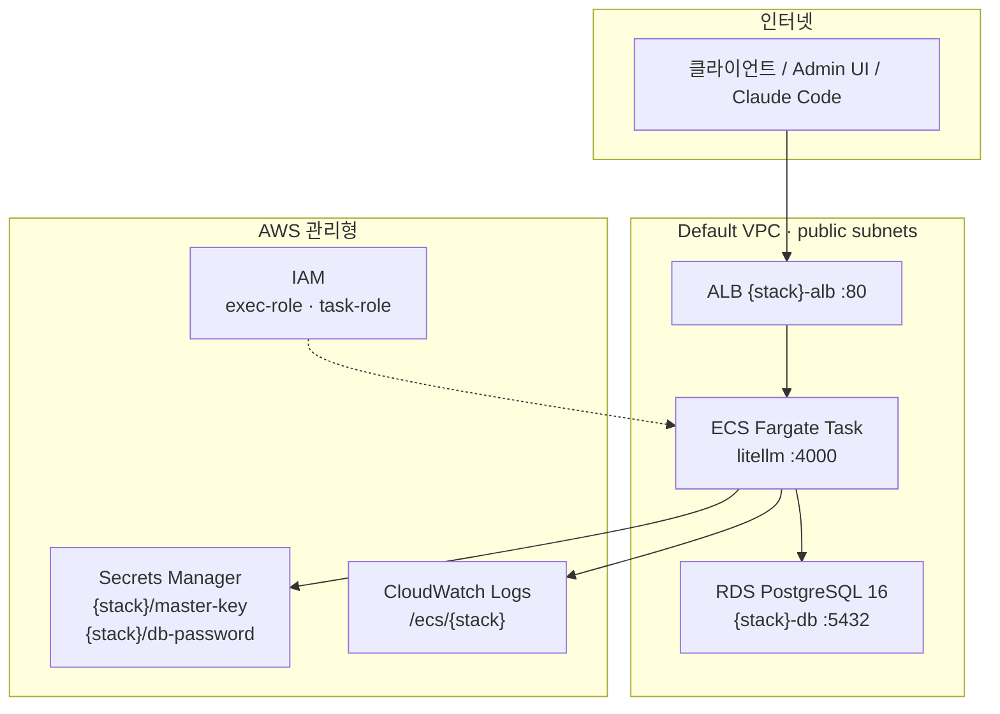

# LiteLLM installer — 생성 인프라

`install/installer.py`가 AWS에 올리는 리소스와 연결 관계를 정리합니다.  
기본 스택명 `{stack}` = `litellm` (예: `litellm-alb`, `litellm-cluster`).

```bash
python install/installer.py deploy --region <region> --stack-name <stack>
python install/installer.py status  --region <region> --stack-name <stack>
python install/uninstaller.py --region <region> --stack-name <stack> --yes
```

이미 ECS 서비스가 `ACTIVE`이고 ALB가 있으면 **deploy는 새로 만들지 않고** `.state-<stack>.json`만 갱신합니다.

---

## 한눈에 보는 구성



배포 순서 (`deploy` 7단계):

1. Networking (SG)  
2. Secrets  
3. RDS  
4. IAM  
5. ALB + Target Group + Listener  
6. Task Definition + Log group  
7. ECS Cluster + Service  

로컬 결과 파일: `install/.state-<stack>.json` (gitignored) — URL, Admin UI, master key 등.

---

## 리소스 목록

아래 이름에서 `{stack}`은 `--stack-name` 값입니다.

### 네트워킹 (신규 VPC는 만들지 않음)

| 리소스 | 이름 / 조건 | 설명 |
|--------|-------------|------|
| VPC | **기존 default VPC** | installer가 VPC를 생성하지 않음. 없으면 실패 |
| Subnet | default VPC의 **public** subnet (≥2) | `MapPublicIpOnLaunch=true` 인 것만 사용 (ALB·ECS·RDS subnet group) |
| Security Group | `{stack}-alb-sg` | ALB용. inbound `0.0.0.0/0:80` |
| Security Group | `{stack}-task-sg` | ECS task용. inbound **ALB SG → :4000** |
| Security Group | `{stack}-db-sg` | RDS용. inbound **Task SG → :5432** |

트래픽:

```
Internet ──:80──► alb-sg ──:4000──► task-sg ──:5432──► db-sg
```

### Secrets Manager

| Secret | 용도 |
|--------|------|
| `{stack}/master-key` | LiteLLM master key (`sk-…`). Admin UI 비밀번호 · API Bearer. Task에 `LITELLM_MASTER_KEY`로 주입 |
| `{stack}/db-password` | RDS master password. `DATABASE_URL` 구성에 사용 (task env로 전달) |

이미 같은 이름 secret이 있으면 **재생성하지 않고** 기존 값을 재사용합니다.

### RDS PostgreSQL

| 항목 | 값 |
|------|-----|
| Identifier | `{stack}-db` |
| Engine | PostgreSQL **16.14** |
| DB name / user | `litellm` / `litellm` |
| Class (기본) | `db.t3.micro` (`--db-instance-class`) |
| Storage (기본) | 20 GiB encrypted |
| Subnet group | `{stack}-db-subnets` (public subnet 목록) |
| PubliclyAccessible | **false** (같은 VPC task만 접근) |
| Backup | 7일 |

LiteLLM은 `DATABASE_URL` + `STORE_MODEL_IN_DB=True`로 키·모델·사용량 등을 DB에 저장합니다.

### IAM

| Role | 정책 | 용도 |
|------|------|------|
| `{stack}-ecs-exec-role` | `AmazonECSTaskExecutionRolePolicy` + inline `LiteLLMSecretsAccess` (`secretsmanager:GetSecretValue` on master-key · db-password) | 이미지 pull, 로그, **시크릿 → env 주입** |
| `{stack}-ecs-task-role` | (기본 정책 없음) | 런타임 앱 역할. Bedrock 등은 별도 부여 필요 (`litellm-test.py --register-bedrock` 등) |

### Application Load Balancer

| 리소스 | 이름 | 설정 |
|--------|------|------|
| ALB | `{stack}-alb` | internet-facing, IPv4, public subnet, `{stack}-alb-sg` |
| Target Group | `{stack}-tg` | HTTP **4000**, target type `ip`, health `/health/liveliness` (200) |
| Listener | port **80** HTTP | forward → `{stack}-tg` |

HTTPS/ACM은 installer가 만들지 않습니다.  
접속 URL: `http://{alb-dns}` · Admin UI: `http://{alb-dns}/ui`

### CloudWatch Logs

| 리소스 | 이름 |
|--------|------|
| Log group | `/ecs/{stack}` |
| Stream prefix | `litellm` |

### ECS Fargate

| 리소스 | 이름 | 설정 |
|--------|------|------|
| Cluster | `{stack}-cluster` | capacity provider `FARGATE` |
| Task definition family | `{stack}-task` | awsvpc, Fargate |
| Service | `{stack}-service` | ALB에 연결, `assignPublicIp=ENABLED`, health grace 120s |
| Container | `litellm` | 이미지 `ghcr.io/berriai/litellm:main-stable`, port **4000** |

Task 기본 스펙 (`--cpu` / `--memory` / `--desired-count`로 변경 가능):

| 항목 | 기본값 |
|------|--------|
| CPU | 1024 (1 vCPU) |
| Memory | 2048 MiB |
| Desired count | 1 |

컨테이너 환경:

| 변수 | 출처 |
|------|------|
| `DATABASE_URL` | RDS endpoint + Secrets의 db password (plain env) |
| `STORE_MODEL_IN_DB` | `True` |
| `PORT` | `4000` |
| `LITELLM_MASTER_KEY` | Secrets Manager `{stack}/master-key` (secret 주입) |

컨테이너 health check: `curl` → `localhost:4000/health/liveliness`.

---

## 태그

가능한 리소스에 공통 태그:

| Key | Value |
|-----|-------|
| `Stack` | `{stack}` |
| `ManagedBy` | `litellm-installer` |
| `Name` | `{stack}` (SG 등) |

---

## 로컬 state 파일

경로: `install/.state-{stack}.json` (`.gitignore` — 커밋 금지)

| 필드 | 의미 |
|------|------|
| `url` | Proxy base URL |
| `admin_ui` | Admin UI URL |
| `master_key` | LiteLLM master key |
| `alb_dns` | ALB DNS |
| `region` / `stack_name` | 배포 식별 |
| `cluster` / `service` | ECS 이름 |
| `updated_at` | UTC ISO8601 |

`deploy` 성공·skip 시, `status` 실행 시 갱신. `destroy` 시 파일 삭제.

---

## destroy / uninstall이 지우는 것

`python install/uninstaller.py --yes` (또는 `installer.py destroy`)가 삭제합니다.

1. ECS service (scale 0 → delete) → task definition deregister → cluster  
2. ALB listeners → ALB → Target Group  
3. RDS instance (`SkipFinalSnapshot`) → DB subnet group  
4. Secrets (`master-key`, `db-password`, ForceDelete)  
5. IAM roles (attached/inline 정책 제거 후)  
6. Security groups (교차 ingress revoke 후 `db` → `task` → `alb`)  
7. CloudWatch log group `/ecs/{stack}`  
8. 로컬 `.state-{stack}.json` (`--keep-state` 로 유지 가능)

```bash
python install/uninstaller.py --region us-west-2 --stack-name litellm --dry-run
python install/uninstaller.py --region us-west-2 --stack-name litellm --yes
```

**삭제하지 않는 것:** default VPC, subnet, 계정 기본 리소스.

---

## installer가 만들지 않는 것

| 항목 | 비고 |
|------|------|
| VPC / NAT / VPC endpoint | default VPC만 사용 |
| HTTPS / ACM / 커스텀 도메인 | HTTP :80 only |
| Cognito / OIDC | master key 인증 |
| Bedrock 모델 등록 · Bedrock IAM | 배포 후 Admin UI / API / `litellm-test.py --register-bedrock` |
| WAF, Auto Scaling, Multi-AZ RDS | 프로덕션 체크리스트 참고 (루트 `README.md`) |

---

## CLI 옵션

| 옵션 | 기본 | 설명 |
|------|------|------|
| `--region` | `us-west-2` | AWS 리전 |
| `--stack-name` | `litellm` | 리소스 이름 prefix |
| `--cpu` | `1024` | Fargate CPU units |
| `--memory` | `2048` | Fargate memory (MiB) |
| `--desired-count` | `1` | ECS desired tasks |
| `--db-instance-class` | `db.t3.micro` | RDS 인스턴스 클래스 |

사용 예와 접속 방법은 루트 [README.md](../README.md)의 **설치 · 배포** / **접속 정보** 절을 보세요.

기본 모델 등록: `python install/register_models.py` (`install/models.py` — Claude는 Bedrock, GPT는 **Bedrock Mantle**).
